# Introduction

## Outline 2

1.  Introduction
2.  Method
3.  Review
4.  Results
5.  Interpretation
6.  Conclusion

## Outline 1

1.  Overview
    1.  Problem
        1.  What is the narrative structure of the Popol Vuh?
            1.  Do the order of events matter?
            2.  Do the events fall into meaningful groups?
            3.  Are the events connected? How so and to what degree? Is there unity of action?
        2.  Do the textual divisions – e.g. parts and chapters – inserted by various editors reflect the narrative structure? Do these divisions reflect the translator's understanding of this structure?
        3.  Can this problem be studied quantitatively? Objectively, in the sense of intersubjectively?
    2.  Methodoligical approach
        1.  Apply traditional methods from text analytics.
        2.  Favor interpretable methods and results. Not AI.
2.  Assumptions
    1.  Definition of text
        1.  Ontological assumptions and commitments of computational text analysis
        2.  In comparison to document
        3.  Irreducible hylomorphism; information as physical but not material
        4.  Material Symbol System + CODEC
    2.  Lexical Significance
        1.  Statistical vs Semantic
    3.  Narratology
        1.  Two kinds of narratology considered here:
            1.  Fabula and Syuzhet (Story and Plot)
            2.  Structure and Event
        2.  Synthesis
            1.  Fabula, Structure, and World
            2.  Operationalize World as topics
            3.  Narrative order of text vs topics
3.  Digital Critical Edition
    1.  Sources: Christenson K'iche' and English
    2.  Word Tokens (TOKEN)
        1.  Fields
        2.  Token pattern used in parsing
        3.  Normalization rules for terms (word types)
    3.  Vocabulary (VOCAB)
        1.  Fields
        2.  Statistics
4.  Models
    1.  Document Term Count Matrix (DTM)
        1.  Model
        2.  Parameters
        3.  Properties
    2.  Term significance Matrix (TFIDF)
        1.  Model
        2.  Parameters
        3.  Properties
    3.  Document Similarity over TFIDF Space (TFIDF_SIM)
        1.  Model
        2.  Parameters
        3.  Properties
    4.  Topics (TOPIC, THETA, PHI)
        1.  Model
        2.  Parameters
        3.  Properties
5.  Comparanda
6.  Gaps
    1.  Connecting RS elements from UVA XOM.

## Overview

The Popol Wuj is ...

The PW has been translated many times ... Most recently the focus has been on poetics ... Against the tyranny of the paragraph.

Discourse structures above the paragraph level have received much less attention, in spite of the fact that translations differ widely in the division of the text into discursive units (see table).

To some the application of computational methods to a sacred text will not seem appropriate. Indeed, there is a longstanding resistance to computational. At worst, these methods may seem to introduce epistemic imperialism.

But numeracy and literacy are not separate concepts for the Maya.

The Maya are well known for their number system, which included the concept of zero, and its application to the development of sophisticated time-keeping systems.

Perhaps less well known is the role of these systems in the structuring of discourse. Maya narrative is scaffolded by temporal structures, so-called calendars.

The systems provide a framework for understanding cosmological and historical processes as well as a scaffolding for both predicting and recounting the unfolding of these processes.

Classic period texts exhibit the connection well — Royal history, the primary subject matter of the hieroglyphic texts, is always framed in reference to highly articulated representations of time.

Calendars are not simply time-keeping devices, they organize space, time, and action. They provide chronotopic ordering of discourse.

## Problem Statement

Current editions of the PW have emphasize the poetic structure of the text. Drawing on ethnopoetics. See Tedlock, Colop, Christenson, Anonymo, etc. Against the tyranny of the paragraph. Also, a focus on orthographic normalization and linguistic alignment.

Discursively, this work addresses the level of the sentence and paragraph, i.e. the micro-level of discourse. There remains an issue at the macro-level -- the text as a whole. Earlier work on the narrative structure of the text – see Edmonson and Gosson.

[Tedlock]{.underline}

This turn has been supported (?) by the claim that the *Popol Vuh* is not organized by Western notions of plot or chapters, but by ceremonial rhythm and cosmological recursion.

> What we have here is not a tale to be told straight through in a single sitting, but rather a layered story structure that invites telling in parts, depending on the occasion and the ritual context.

Tedlock highlights how the four creations function like recursive mythic cycles, each attempting and failing to generate fully realized humans.

These cycles build narrative tension and philosophical insight — each failure narratively anticipates its successor.

> The Popol Vuh builds toward the final creation through failed models… each version of humanity is a variation on a theme, with different relationships to speech, memory, and devotion.

[Response]{.underline}

Two problems: plots and chapters are not particularly western. There is strong evidence for the organization structure of other texts. What Tedlock describes actually suggests a structure.

Mayan narratology makes sense of the calendars.

In contrast, this essay shifts focus to the forest for the trees.

## Inferring the Narrative Structure of the *Popol Wuj*

Narrative structure is highly variant

Existing Narrative Divisions

-   Recinos, Colop, Tedlock, Christenson
-   Other examples sampled from non-academic editions
-   Display in table showing number of parts and number of chapter

| ID  | Author                 | Year | Language |
|-----|------------------------|------|----------|
| Sc  | Scherzer               | 1857 | Spanish  |
| Br  | Brasseur (de Bourborg) | 1861 | French   |
| Re  | Recinos                | 1947 | Spanish  |
| Ed  | Edmonson               | 1971 | English  |
| Te  | Tedlock                | 1985 | English  |
| Ch  | Christenson            | 2003 | English  |
| Co  | Colop                  | 2011 | Spanish  |
| Ba  | Bazzett                | 2018 | English  |
| So  | Sotelo                 | 2018 | Spanish  |

: Editions consulted.

| Edition     | Parts | Chapters | Comments                        |
|-------------|-------|----------|---------------------------------|
| Scherzer    | —     | —        | Follows original paragraphs.    |
| Brasseur    | 4     | 45       | Introduces divisions.           |
| Recinos     | 4     | 46       | Preamble not included in parts. |
| Edmonson    | 4     | 97       | Follows original paragraphs.    |
| Tedlock     | 5     | 80       |                                 |
| Christenson | —     | 87       | Follows original paragraphs.    |
| Colop       | 5     | —        | Colop calls parts chapters.     |
| Bazzett     | 4     | 44       | Excludes historical chapters.   |
| Sotelo      | 4     | 43       |                                 |

: Part and chapter divisions in various editions.

| Ch  | Br   | Re   | Ed  | Te  | Co  | Ba  | So  |
|-----|------|------|-----|-----|-----|-----|-----|
| 1   | I    |      | I   | I   | I   | I   | I   |
| 2   |      | I    |     |     |     |     |     |
| 9   |      |      | II  |     | II  | II  |     |
| 10  |      |      |     | II  |     |     |     |
| 15  | II   | II   | III | III | III | III |     |
| 22  |      |      |     |     |     |     | II  |
| 41  | III  | III  | IV  | IV  | IV  | IV  | III |
| 57  | IV\* | IV\* |     |     |     |     | IV  |
| 65  |      |      |     | V   | V   |     |     |

: Alignments of parts among editions using Christenson as baseline.

\* Part IV of Brasseur and Recinos are curious for beginning in the middle of a paragraph. The cut is made on line 24 of Folio 42 recto. See reasoning below.

| Chapter | Title                                                  |
|---------|--------------------------------------------------------|
| 1       | Preamble.                                              |
| 2       | The Primordial World.                                  |
| 9       | The Pride of Seven Macaw before the Dawn.              |
| 10      | The Fall of Seven Macaw and his Sons.                  |
| 15      | The Tale of the Father of Hunahpu and Xbalanque.       |
| 22      | Hunahpu and Xbalanque in the House of the Grandmother. |
| 41      | The Creation of Humanity.                              |
| 57      | Offerings are Made to the Gods.                        |
| 65      | The Sons of the Progenitors Journey to Tulan.          |

: Chapter titles in Christenson.

## Note Regarding Br and Re Division

Br and Re both begin Part 4 in the middle of Ch Chapter 57, "Offerings are Made to the Gods," p. 233.

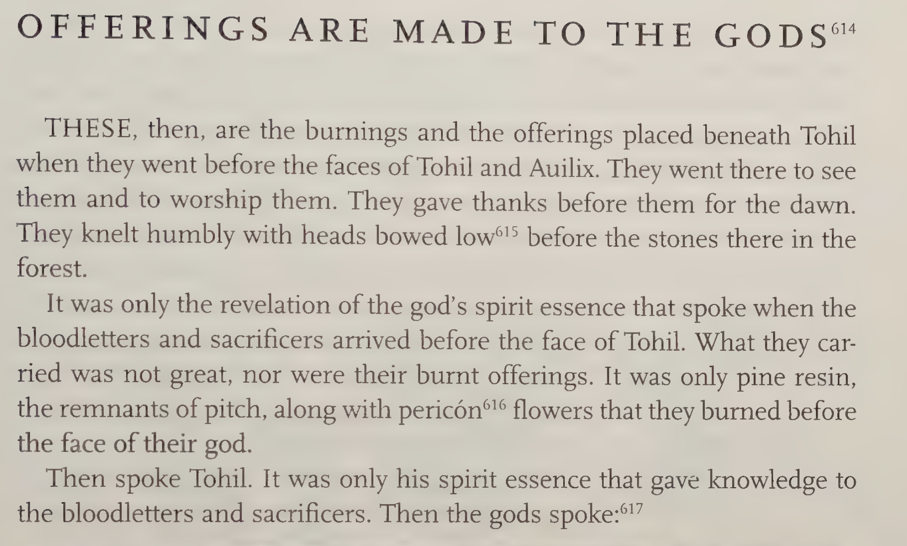

Lines 6300 to 6513

Recinos part 4 begins (Re 127):

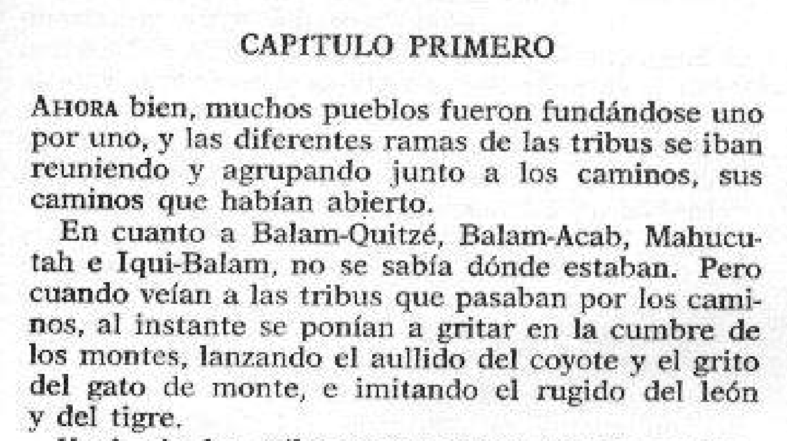

And Br

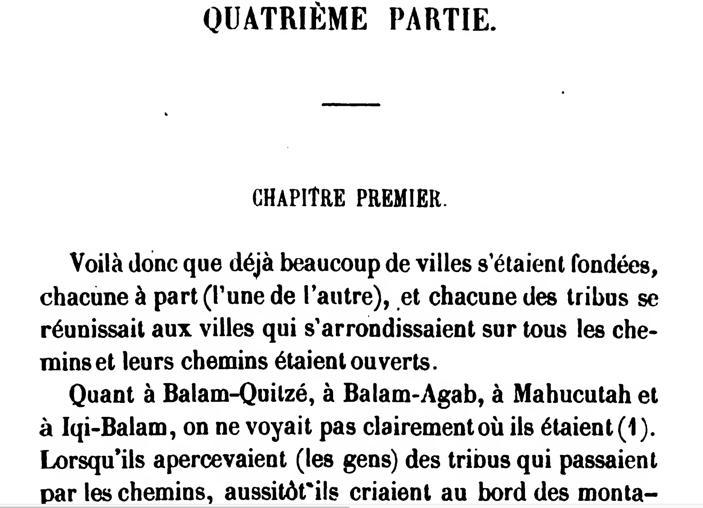

This is where Br and Re begin in Ch:

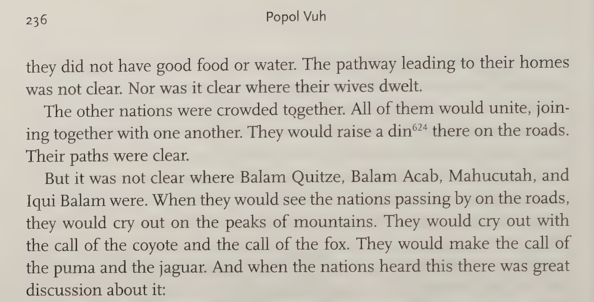

This corresponds to line $6425$ (Folio 42 recto, line 24?) in the original MS.

-   There therefore crowded now the nations,

-   Are k'ut tzatz chik ri amaq',

Note: Incorrectly listed as line $6410 + 5$ in Christenson's transcription:

```         
Folio 42 recto

catoh chiquivach 6370ta xticar cut v
tzucuxic ri ral tac q,iquin ral
queh camob tzucuxic cumal ri
ahquixb ahcahb are cut ta
chiquiric ri q,iquin al queh ca-
te cut chibe 6380qui culu ri vquiquel
queh q,iquin pu chi ri abah ri to-
hil aulix xucari cut vcaah quic
cumal cabauil huzu chi qhau ri
abah ta queoponic ri ahquixb
6390ahcahb ta chibe quiya qui catoh
xavi quehe chic chiquibano
chuvach ri cuqueh chi qui cat εol
chi qui cat puch yia, holom ocox
xqohe qui cu queh chiquihuhu-
nal 6400chiri cul vi cumal chuvi hu-
yub maui qui lacaben ri cochoch
chi quihil xapatac huyub quebi-
invi are cut chique chaah ri xa
ral vorom. xa ral zital xa pu ral
acah, 6410chiquitzucuh mana vtzilah
va vtzilah a. tapuch maui ca-
lah vbeel cochoch maui calah
qovi canoc quixoquila, [are cut        <-- Br beings Part IV here
tzatz chic riamac] huhun chi zepe-
zoh vi qui cuchun chiquib ri hu-
tac chob chi amac, quebolo chic
patac be 6420calah chi quibe. are cu-
ri balam quitze, balam acab, ma-
```

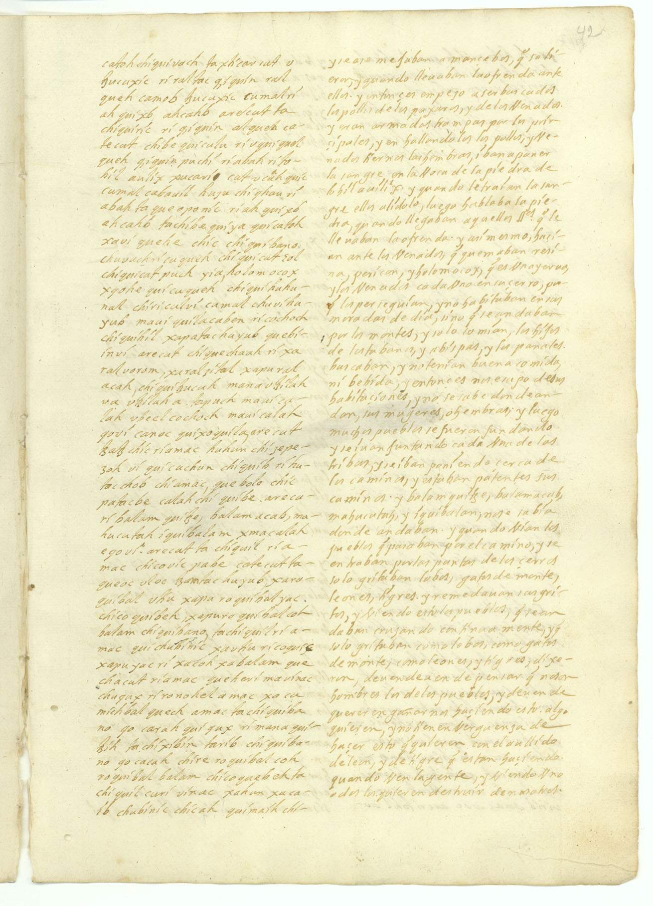

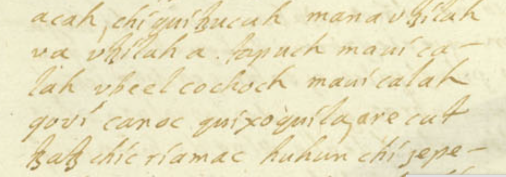

No orthographic reasons for making this division.

## Rationales for Divisions

Viewed collectively, each edition divides the text into parts and chapters. Exceptions are Christenson, who does not use parts, Colop, who does not use chapters (although he calls parts chapters), and Sherzer, who follows the original paragraph divisions without naming or numbering them.

[Minor divisions]{.underline}

Two groups.

Minor divisions in the first group one are based on visual clues in the text, i.e. capitalization and indents..

Edmonson and Christenson both base their chapter divisions on the visual clues from the manuscript. The discrepancy owes to the use of these visual clues by the authors at the end of the story, where capitalizations and indentations are used to signify names in lists

Minor division in the second group divide the text into half the number.

NOTE: Visual clues are consistent with discourse markers. However, we must consider that the rationale for the divisions in Ximenez appears to be deictic. See Tedlock's remarks. This Leaves open the possibility that these are not due to the requirements of oral storytelling.

[Major divisions]{.underline}

Some do four, some do five, some eschew part level divisions.

The major divisions (parts) appear to be based on the translator's sense of when a new topic begins.

> Le Livre Sacré est divisé en quatre parties distinctes : les deux premières sont les plus intéressantes; car elles contiennent une transcription à peu près littérale du Papol Vuh, qui parait avoir été l'original du Teo-Amoxtli, ou Livre divin des Toltèques (1), si célèbre dans les traditions mexicaines. Les deux dernières, quoique contenant encore un grand nombre de traditions relatives à des époques fort anciennes, présentent plutôt dans leur ensemble un recueil d'annales historiques qui ont pour objet la nation Quichée, maitressç, au temps de la conquête, de la plus grande partie de la république actuelle de Guatemala.
>
> \(1\) Le liire de Livre sacré, que je donne à cet ouvrage, n'est pas rigoureusement la traduction de Popol Vuh, que je traduis dans le texte par Livre national. Le mot popol vient de pop, verbe radical qui signifie s'assembler, se réunir en conseil; mais tes cliefe de la nation ayant seuls la prérogative de délibérer, il s'ensuit quê le mot popol, tout en exprimant une idée commune, s'appliquait à la nation par excellence, au sénat; de là le titre de Libro del comun, ainsi que le traduit Zimenez; de là aussi le caractère de ce livre, qui était d'autant plus sacré, qn'il renfermait l'origine des dieux et de la religion, et que tes nobles H les prêtres seuls pouvaient le consulter. Le radical fwp signifie aussi la natte , le tapis; de à ahpop, maitre d'un tapis, pour seigneur, parce que les seigneurs seuls y avaient droit; mais il est impossible de dire si le mot pop, natte ou tapis, a pour origine le verbe, parce qu'on s'assemblait assis sur des nattes, ou si le verbe vient de la natte, où l'on se réunissait.
>
> The Sacred Book is divided into four distinct parts: the first two are the most interesting; for they contain an almost literal transcription of the Papol Vuh, which appears to have been the original of the Teo-Amoxtli, or Divine Book of the Toltecs (1), so famous in Mexican traditions. The last two, although still containing a large number of traditions relating to very ancient times, present rather as a whole a collection of historical annals which have as their object the Quiché nation, mistress, at the time of the conquest, of the greater part of the present republic of Guatemala.
>
> \(1\) The title of Sacred Book, which I give to this work, is not strictly the translation of Popol Vuh, which I translate in the text by National Book. The word popol comes from pop, a radical verb which means to assemble, to meet in council; but the clergy of the nation having alone the prerogative to deliberate, it follows that the word popol, while expressing a common idea, applied to the nation par excellence, to the senate; hence the title of Libro del comun, as Zimenez translates it; hence also the character of this book, which was all the more sacred, as it contained the origin of the gods and of religion, and that the nobles (H) only the priests could consult it. The radical fwp also means the mat, the carpet; from ahpop, master of a carpet, for lord, because the lords alone had the right to it; but it is impossible to say whether the word pop, mat or carpet, has its origin in the verb, because people gathered sitting on mats, or whether the verb comes from the mat, where people gathered.

> In the original that we publish here in its entirety, there was no division by books or chapters: the one we have adopted is intended to facilitate reading, and we have deliberately cut each chapter into very short paragraphs, in order to make its interpretation easier for philologists wishing to compare this language with others, by studying its words and grammatical forms: the translation of the Sacred Book is as literal as it has been possible to make it (Br xv)

Although Recinos divides the text into four parts, along with a preamble, in his introduction he writes that we wan distinguish three parts in the text: (1) the creation of humans, (2) the exploits of the two boys, and (3) the history of the indigenous peoples.

Christenson dispenses with major divisions altogether, in keeping with the editorial goal of keeping as close to the original as possible.

Edmonson's is the only edition (among those considered here) that provides a rational for the major divisions. He divides the text into four "creations." However, he maps a four-part structure that appears in the first part of text onto the entire text. Also, referring to the events in Xibalba as a "creation" seems forced.

Bassett argues that the narrative arc of the story is completed before the protohistory begins and therefore does not include the latter in his edition. While separating the text in this way destroys the connection between religion and politics that appears to be an essential part of the story, it does highlight an important aspect of the division of the text into ontological registers.

The primary division: Before and after the first rising.

## The Four Creations Model

The ordering of events in the story is likely not arbitrary, especially given the origin of the text in indigenous form.

All editions agree on a a primary division between the apotheosis of the Two Boys and the creation of the first four true humans.

The ordering of the text may be reflective of the ontology or cosmovision of the Maya.

Edmonson's division is based in a theory of Mayan cosmology and its connection to historical time:

> The theme of the Popol Vuh is the greatness of Quiche: the people, the place, and the religious mysteries which were all called by that name. It is a tragic theme, but its treatment is not tragic: it is Mayan. The rise and fall of Quiche glory is placed in the cosmic cycling of all creation, and when it is ended, like the cycles of Mayan time, it stops. In cyclic time, of course, every end is a beginning. But the end of the glory of Quiche is not self-renewing. The author has treated his theme as though Quiche and its glory were the central feature of the epoch of which there is human knowledge. The next cycle will be something else, perhaps the epoch suggested by the closing line of the work, something “called Holy Cross.”
>
> The cycle of "what is called Quiche" is made up of subcycles — the four creations of the world. They are given unequal treatment. The first cycle ends at line 820 with the fall of the puppets carved of wood who did not learn to worship the gods. The second ends at line 1674 with the destruction of 7 Parrot and his sons for their pride. The third terminates at line 4708 when the hero twins, Hunter and Jaguar Deer, are transformed into the Sun and Moon. Almost half of the text deals with the fourth creation, from the First Fathers to the present time. Presiding over all four is the Heart of Heaven and Earth, author and parent of creation, to whom the men of the fourth creation learn to pray under a variety of names.

Edmonson 1971: xiii-xiv

It's not clear that Edmonson's creations are correct, but the principle seems correct ...

Brasseur also describes four creations.

Viewed in comparative perspective. Gossen compares the Chamula (Tzotzil Maya) and K'iche' traditions:

> One of the more striking points of similarity between the two bodies of narrative tradition is overall organization. Modern Chamulas, like their pre-Columbian forebears, believe in a four-part creation cycle, of which we are living in the fourth and final phase. This cosmological underpinning of Maya thought emerges as the major organizational principle of both the Popol Vuh and my corpus of modern Chamula material (cf. Edmonson 1971: 7-8). The four major sections of the Popol Vuh explicitly report the events of the four creations, in serial order, proceeding from the "first dawn of order" by the hand of the "Heart of Heaven," throngh three destructious and three re-creations, leading to the fourth and final creation. Each cyclical destruction was sent by the Heart of Heaven because he felt that his efforts on behalf of mankind were not appreciated; furthermore, people fought and were evil and did not respect him; hence they were destroyed (see Edmouson 1971: xiv). The basic pattern of content of the narrative moves increasingly close to human behavior throughout the four creations; moving from a time of the gods and initial creation, through a heroic period, and finally into an explicitly historic period in the Fourth Creation, full of the chronicles of battles, migrations, disasters, and bitter competition among lineages for political dominance.
>
> The parallel with modern Chamula material in overall organization is striking. They classify narrative events as belonging to one of two classes, Ancient Words or Recent Words. Recent Words refer to events that happened in the Fourth and final Creation. Within Ancient Words are included the events of the First, Second and Third Creations; each text can be so classified according to serial creations by narrators. So consistent was this taxonomic reference to the four creations that I was able to elicit for nearly every text in my corpus the informant's opinion as to which one (or several) of the four creations it pertained to. Furthermore, the same criterial attributes apply to the rest of Chamula oral tradition. For example, songs and formal speech are classified as Ancient Words, associated with the First or Second Creations; whereas recent history, gossip, verbal dueling, and other genres which do not explicitly invoke or speak to supernaturals, are classified as Recent Words, associated with the Fourth Creation.

Gossen 1978: 270.

Gossen inherits Edmonson's understanding of the four creations.

Tedlock also holds to a four creations model.

Here, Tedlock explicitly outlines the structure of the Popol Vuh and states that the narrative is organized into four creations or world eras, each representing a failed or partial attempt to bring forth a true human world — until the final, successful one.

See Introduction to the second edition, “The Structure of the Book” (Popol Vuh, rev. ed., 1996, p. 61–63).

Tedlock outlines the structure of the Popol Vuh and states that the narrative is organized into four creations, each representing a failed or partial attempt to bring forth a true human world — until the final, successful one.

Tedlock’s Breakdown of the Four Creations:

1.  First Creation: Animals are created but cannot speak or worship, so they are relegated to the wilderness.
2.  Second Creation: Mud people are formed but are fragile and melt away.
3.  Third Creation: Wood people who survive and multiply but lack souls or gratitude. They are destroyed by a cataclysm and by their own animals and tools.
4.  Fourth Creation: The Hero Twin saga bridges this mythic past and the final successful creation of people from maize, the sacred substance of the Maya.

The third creation is the Dawn. Includes Seven Macaw.

Although Edmonson and Tedlock agree that the text presents four creations, their mapping of these categories onto the events of the story differ.

| Creation | Br          | Ed                             | Te          |
|----------|-------------|--------------------------------|-------------|
| 1        | Animals     | Wood people                    | Animals     |
| 2        | Mud People  | Two Boys defeat 7 Macaw        | Mud people  |
| 3        | Wood people | Two Boys defeat Lords of Death | Wood people |
| Pivot    |             | NA                             | Two Boys    |
| 4        | Corn People | Corn People                    | Corn people |

: Comparison of the four creations in Brasseur, Edmonson, and Tedlock.

Tedlock's divisions make sense, but this leaves the problem of how the two stories involving the Two Boys fit into the creation. Tedlock's solution is to two-fold. First, the Two Boys occupy a pivotal position between the first three and the last creations. Second, there is no requirement to align these stories.

However, there is evidence for alignment. Reference to the dawn is a constant throughout the stories (even though there are "days" before the first dawn).

## Mayan Narratology

*Syuzhet* and *fabula*, discourse and the story, take on a particular significance in the context of Mayan discourse.

Narrative is structured by reference to the First Dawn.

Thematically, the story describes the connection between before and after as the relationship by gods and humans.

Scene changes reflect movements in time and space. These may be linear on non-linear.

For the Maya, the relationship between fabula and syuzhet is defined by their shared relationship to time and the ordering of time by astronomical calendars.

The sequencing of events is governed by their relationship to cosmic time.

Establishes a legitimation charter for K'iche' kingship.

Idea: Instead of Narrative vs Story, focus on Narrative vs Themes

## Themes

Recinos identifies 3 themes: Creation, the adventures of the Two Boys and their Fathers, and the History

> En el Popol Vuh pueden distinguirse tres partes. La primera es una descripción de **la creación y del origen del hombre**, que después de varios ensayos infructuosos fue hecho de maíz, el grano que constituye la base de la alimentación de los naturales de México y Centroamérica.
>
> En la segunda parte se refieren **las aventuras de los jóvenes semidioses Hunahpú e Ixbalanqué y de sus padres sacrificados por los genios del mal en su reino sombrío de Xibalbay**; y en el curso de varios episodios llenos de interés se obtiene una lección de moral, el castigo de los malvados y la humillación de los soberbios. Rasgos ingeniosos adornan el drama mitológico que en el campo de la invención y expresión artística no tiene rival en la América precolombina. \[The second part recounts the adventures of the young demigods Hunahpú and Xbalanqué, along with their parents, sacrificed by the evil spirits in their shadowy kingdom of Xibalbay. Over the course of several interesting episodes, a moral lesson is delivered, along with the punishment of the wicked and the humiliation of the arrogant. Ingenious features adorn this mythological drama, which, in terms of invention and artistic expression, is unrivaled in pre-Columbian America.\]
>
> La tercera parte no presenta el atractivo literario de la segunda, pero encierra **un caudal de noticias relativas al origen de los pueblos indígenas de Guatemala, sus emigraciones, su distribución en el territorio, sus guerras y el predominio de la raza quiché hasta poco antes de la conquista española**. \[... a wealth of information relating to the origin of the indigenous peoples of Guatemala, their migrations, their distribution throughout the territory, their wars, and the predominance of the Quiché race until shortly before the Spanish conquest.\]

(Recinos 1947: 16)

# Methodology

## Computational Methods

Narratology with Computational Support

## Method

-   Apply traditional document summarization methods
    -   Although these methods are quantitative and computational, they do not employ AI
    -   Methods go back to Markov's study of Origen ... Language models
    -   Not AI
-   Choose Christenson's noramlized K'iche'
    -   Differs slightly from Colop. So, why Christenson? Colop's edition does not map to Ximenez; Christenson does.
-   Align Christenson's chapter titles to the literal lines
-   Group K'iche' by Chapter
-   Convert to Tokens
-   Model thematic structure with

## Hyperparameters

-   Segmentation (chunk or discursive unit)
-   Chunk size / number of chunks
-   Frequency and significance measures and cut-offs
-   Ngram min and max
-   Number of clusters
-   Number of topics

## Data Flow

-   Source materials
-   OHCO models
-   Chunk models
-   BOW / Count Matrix
-   TFIDF

# Results

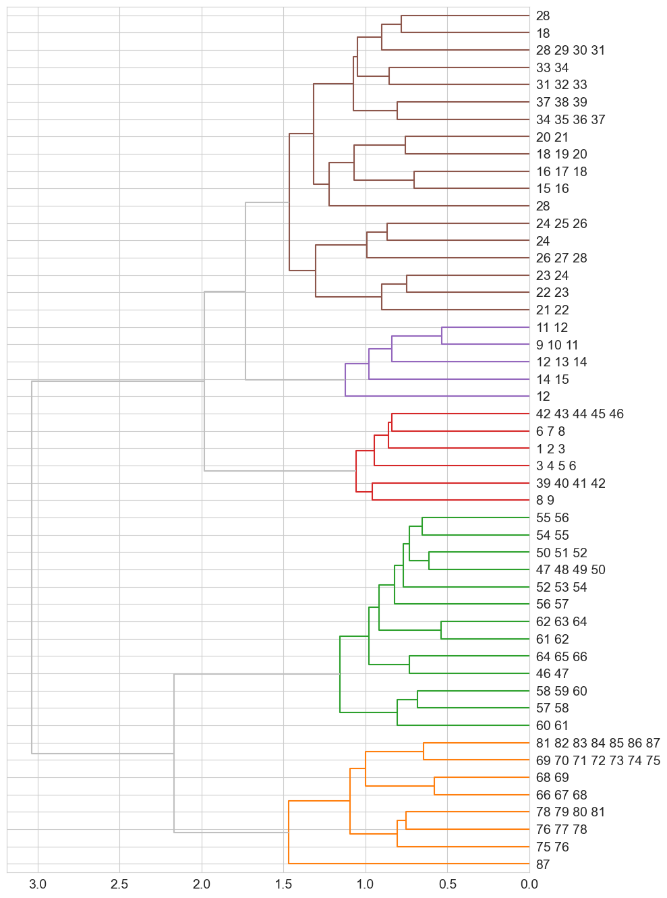

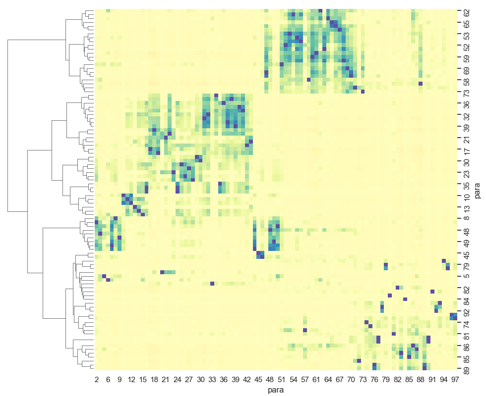

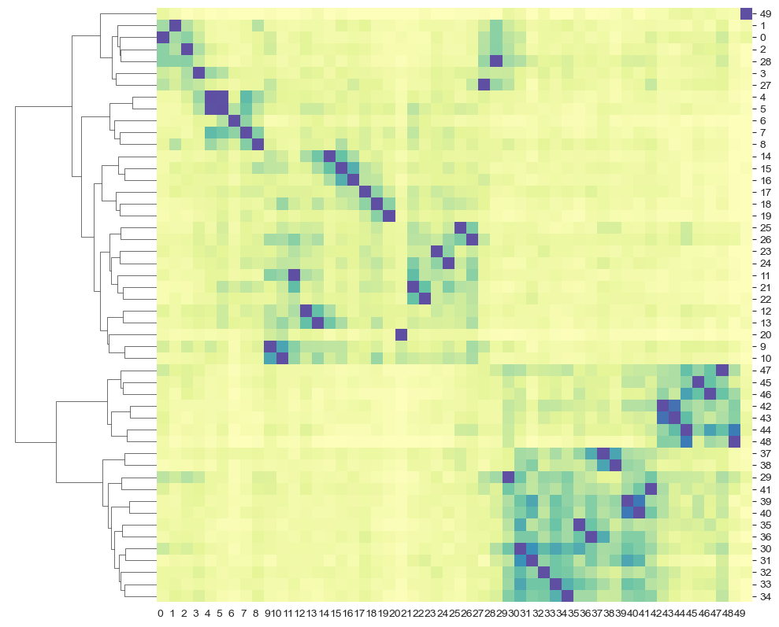

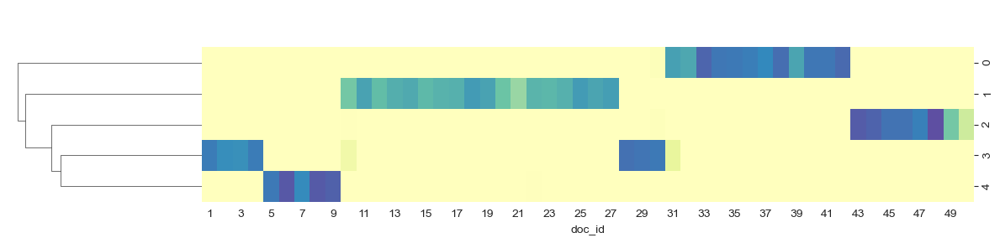

| topic_id | top_terms | gloss |
|-----------------:|:----------------------------------|:-----------------|
| 0 | b'alam, amaq, tojil, kitze, b'alam kitze, b'alam aq'ab, majukutaj, kitze b'alam, k'ab'awil, aq'ab | b'alam |
| 1 | xib'alb'a, junajpu, kame, xcha, kik, b'a, la, q'apoj, xb'alanke, utz | xib'alb'a |
| 2 | ajaw, nim ja, ajawab, k'iche, tinamit, aj, aj pop, pop, nim, amaq | ajaw |
| 3 | kaj, aj, winaq, b'it, ulew, tz'aq, b'itol, tz'aqol, tz'aqol b'itol, alom | kaj |
| 4 | wuqub kaqix, k'ajolab, kaqix, sipakna, ri sipakna, wuqub, jul, kab'raqan, junajpu, ri wuqub | wuqub kaqix |

: Topics

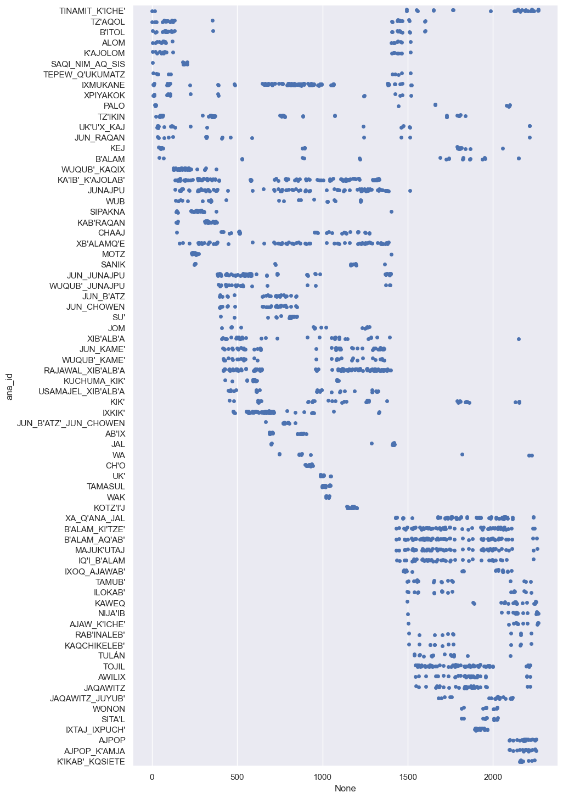

## Discussion

## Conclusion

-   Define parts in terms of significant time movements, e.g. going back to the birth of the Two Boys after describing their defeat of Seven Macaw.
-   Visualization of parts (stacked and overlapping) fabula vs syuzhet
-   The PW is often called a creation myth but its focus is on tracing the K'iche' kingdom to its divine origins.
-   The story is divided into two major parts. The two parts complement each other. They also exhibit an internal structure.
-   Consistent with Christenson, the text exhibits a strong chiasmatic bias.

```{=html}
<!--
| Christenson | Recinos | Tedlock | Colop | Bazzett | Sotelo |
|------------|------------|------------|------------|------------|------------|
| 1\. Preamble. | 0 | I | I | I | I |
| 2\. The Primordial World. | I |  |  |  |  |
| 9\. The Pride of Seven Macaw before the Dawn. |  |  | II | II |  |
| 10\. The Fall of Seven Macaw and his Sons. |  | II |  |  |  |
| 15\. The Tale of the Father of Hunahpu and Xbalanque. | II | III | III | III |  |
| 22\. Hunahpu and Xbalanque in the house of the Grandmother. |  |  |  |  | II |
| **41. The Creation of Humanity.** | III | IV | IV | IV | III |
| 57\. Offerings are Made to the Gods. | IV\* |  |  |  | IV |
| 65\. The Sons of the Progenitors Journey to Tulan. |  | V | V |  |  |
-->
```